# 🎧 TuneBar (Advanced Edition) — Autonomous AI Voice Assistant & Smart Media Bar


-green)


**TuneBar Advanced Edition** is an extensive architectural evolution of the original TuneBar project for the official [Waveshare ESP32-S3-Touch-LCD-3.49](https://docs.waveshare.com/ESP32-S3-Touch-LCD-3.49?variant=ESP32-S3-Touch-LCD-3.49) development platform. What began as a palm-sized internet radio has been re-engineered into an autonomous **AI Voice Assistant**, smart media bar, and distributed telemetry station with high-fidelity acoustic processing, advanced power management (breathing PWM & audio gating), robust DRAM memory engineering, multilingual global internet radio across 6 languages, LAN media streaming, and secure parameterization.

---

### 📦 Hardware Overview & Global Sourcing

TuneBar runs on the 3.49-inch capacitive touch screen development board powered by the **ESP32-S3R8** (dual-core 240 MHz, 16MB Flash, 8MB OPI PSRAM) with an integrated acoustic front-end (dual MEMS microphones + ES7210 ADC), audio codec (ES8311 DAC + NS4150B amplifier), 6-axis IMU, and RTC:

<p align="center">
  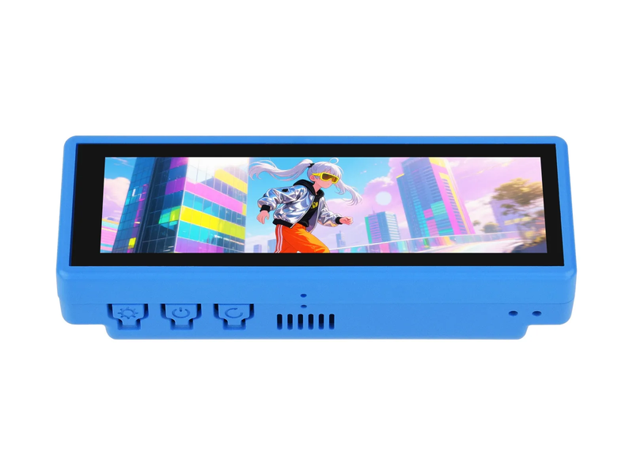
  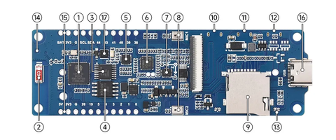
</p>
<p align="center">
  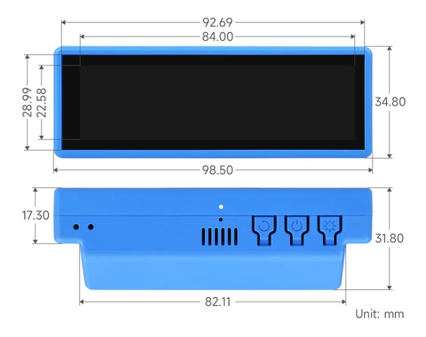
  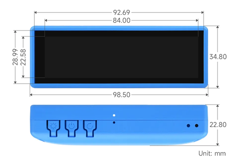
</p>

*Hardware photos and dimensional diagrams source: [Waveshare Documentation](https://docs.waveshare.com/ESP32-S3-Touch-LCD-3.49?variant=ESP32-S3-Touch-LCD-3.49).*

#### 🛒 Where to Buy (Trusted Resellers by Region & Supported Languages)
For makers looking to build or replicate this device, the board is widely available through established distributors:
* **🇮🇳 India (Hindi / HI)**: [Evelta Electronics](https://www.evelta.com) (Search SKU `061-32374` / *Waveshare ESP32-S3 Touch LCD 3.49*).
* **🌐 Global / North America (English / EN & Spanish / ES)**: [Waveshare Official Store](https://www.waveshare.com/esp32-s3-touch-lcd-3.49.htm) and official stores on AliExpress.
* **🇪🇺 Europe / DACH (German / DE)**: [BerryBase](https://www.berrybase.de) and [Welectron](https://www.welectron.com).
* **🇯🇵 Japan (Japanese / JA)**: [Switch Science](https://www.switch-science.com) and Waveshare Direct.

> [!NOTE]
> **Community Notice**: The purchase links above are provided strictly for community reference to help makers source genuine hardware across supported regions. **None of these are affiliate links**, and the author receives no compensation, commission, or financial benefit from any retailer.

## 📸 Interface Showcase (Authentic Hardware Captures)

*All captures shown below are 100% genuine uncompressed framebuffers extracted directly from the physical ESP32-S3 hardware via `/api/screenshot`.*

### 1. Retro Nixie Digital Clock Face
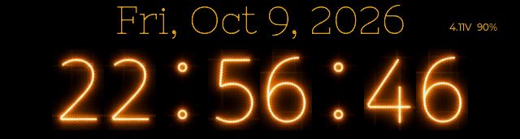
- **What it is**: Authentic retro glowing Nixie tube display driven by the hardware PCF85063 RTC with real-time day/date and hardware battery telemetry (voltage and percentage).
- **How to use**: Tap anywhere on the screen to wake the display to full configured brightness.
- **Gestures**: Swipe **Left or Right ($\leftarrow / \rightarrow$)** to transition between the Clock, Weather Panel, and Alarm. Swipe **Up ($\uparrow$)** to open the Main Menu launcher.
- **Power Optimization**: When left idle, the clock automatically activates gentle sine-wave breathing PWM dimming and powers down the Wi-Fi modem to conserve up to ~62% battery power.

---

### 2. Live Weather, AQI & Climate Panel
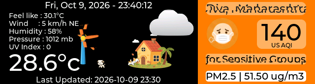
- **What it is**: Ambient climate station displaying live weather conditions, temperature ($^\circ\text{C}$ or $^\circ\text{F}$), relative humidity, local wind speed, and animated weather icons.
- **Air Quality Monitoring**: Includes an integrated US AQI / PM2.5 particulate monitor with color-coded safety indices.
- **How to use**: Telemetry updates automatically over Wi-Fi in the background; city and geolocation can be adjusted in `Settings -> Region`.
- **Gestures**: Swipe **Right ($\rightarrow$)** to return to the Nixie Clock, swipe **Left ($\leftarrow$)** to open the Alarm Clock, or swipe **Up ($\uparrow$)** to return to the Main Menu.

---

### 3. Retro Alarm Clock
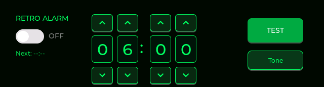
- **What it is**: Dedicated emerald-green retro alarm interface with independent hour and minute digit adjustment controls.
- **How to use**: Use the **[+]** and **[-]** buttons above and below each digit to set your desired wake-up time. Tap the **Enable/Disable** button to arm or disarm the alarm.
- **Acoustic Audit**: Tap the **TEST** button to immediately audit alarm audio playback through the NS4150B amplifier and 8Ω speaker.
- **Gestures**: Swipe **Right ($\rightarrow$)** to return to the Weather Panel or Nixie Clock. Swipe **Up ($\uparrow$)** to return to the Main Menu. When an alarm is sounding, tap anywhere on screen to silence it.

---

### 4. Main Menu Carousel (Segoe UI Bold Neon Cards)
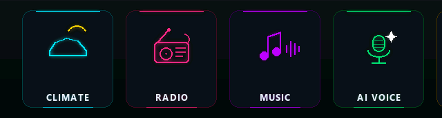
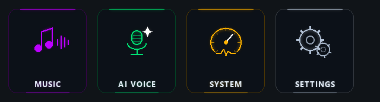
- **What it is**: Ultra-crisp $640\times180$ horizontal launcher carousel featuring 6 custom neon cards: **CLIMATE** (Cyan), **RADIO** (Pink), **MUSIC** (Purple), **AI VOICE** (Emerald Green), **SYSTEM** (Amber Gold), and **SETTINGS** (Slate).
- **How to use**: Drag horizontally left or right across the screen to pan across all 6 applications. Tap any card icon to launch that application instantly.
- **Audio Pulse Feedback**: When an audio stream or music track is playing in the background, the active app card gently breathes with a soft 1.0s luminance opacity curve in the carousel, providing elegant visual playback status without burning CPU cycles on texture scaling.
- **Gestures**: Swipe down from the top edge to quickly lock or return to the Nixie Clock.

---

### 5. Multilingual Global Internet Radio Player
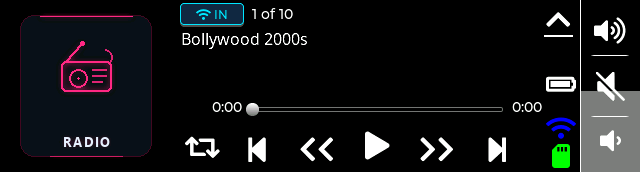

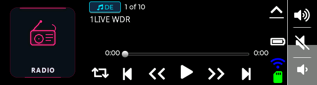
- **What it is**: International live-streaming internet radio player supporting 6 world languages (**HI**, **EN**, **ES**, **CN**, **DE**, **JA**) with dynamic language badge indicators (`[ ♫ HI ]`, `[ ♫ EN ]`, `[ ♫ DE ]`, etc.).
- **How to use**: Tap **Play/Pause** to start or stop streaming; use **Next Track ($▶▶$)** and **Previous Track ($◀◀$)** to cycle through the 10 curated stations.
- **Catalog Cycling**: Tap the catalog badge button directly to cycle through station presets or switch sub-catalogs.
- **Gestures**: Swipe **Up ($\uparrow$)** anywhere on the player screen to return smoothly to the Main Menu while radio audio continues playing uninterrupted in the background.

---

### 6. Settings Suite — Multilingual Radio Language Selector
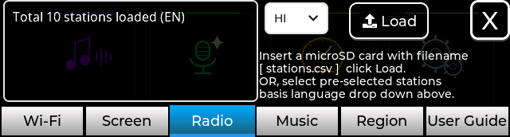
- **What it is**: Dedicated radio configuration tab in `Settings -> Radio` equipped with an on-device 2-letter language dropdown selector (`HI`, `EN`, `ES`, `CN`, `DE`, `JA`).
- **How to use**: Select any 2-letter language code from the dropdown to immediately write the 10 curated stations to LittleFS `/stations.csv` and persist your preference in NVS across reboots.
- **MicroSD Card Loading**: Insert a microSD card with a custom `stations.csv` file and click **Load** to import your own custom station catalog.
- **Live Diagnostics**: The status readout confirms the total loaded stations and active language code (e.g. `Total 10 stations loaded (EN)`). Tap the top-right **[X]** button to save settings and exit.

---

### 7. Media Player Subsystem — Local SD & LAN Streaming
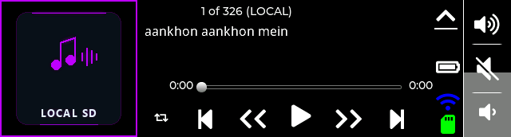
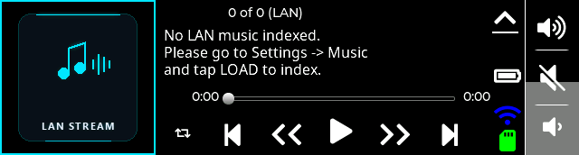
- **What it is**: Unified high-performance media engine with single-tap source switching between **LOCAL SD** (purple neon glow, $O(1)$ PSRAM seek) and **LAN STREAM** (cyan neon glow, local Wi-Fi HTTP streaming).
- **How to use**: Tap the album art card icon in the top-left corner to toggle instantly between Local SD card playback and LAN streaming modes.
- **Playback Controls**: Features Play/Pause, Next/Previous track, Seek Forward (+5s), Seek Rewind (-5s), Shuffle mode toggle, and an on-screen volume slider.
- **Gestures**: Swipe **Up ($\uparrow$)** anywhere on the player screen to return to the Main Menu while audio continues playing in the background.

---

### 8. Autonomous AI Voice Assistant
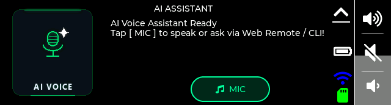
- **What it is**: Full-duplex conversational voice interface utilizing the onboard dual ES7210 MEMS microphones, hardware voice activity detection (VAD), and cloud AI reasoning.
- **How to use**: Tap the green microphone button on screen (or send an `ask <prompt>` serial/REST command) to begin speaking. Speak naturally; the assistant automatically detects when you stop speaking.
- **Pipeline Speed**: Audio is compressed and sent to Groq Whisper STT (<200ms), processed by Llama 3.3 70B reasoning, and streamed back via Microsoft Edge-TTS through the onboard speaker.
- **Gestures**: Swipe **Up ($\uparrow$)** anywhere on screen to dismiss the assistant and return to the Main Menu.

---

### 9. System Diagnostics & Hardware Utilities

- **What it is**: Utility dashboard providing instant access to the ultra-bright **LED Torch** flashlight and deep **System Info** diagnostics.
- **Torch Operation**: Tap the Torch icon to drive the AP3032 backlight boost converter to 100% brightness (maximum LCD white screen luminance). Simply **tap anywhere on the screen** to turn off the torch.
- **System Telemetry**: Tap the System Info button to view real-time internal DRAM free memory, external PSRAM usage, FreeRTOS task high-water marks, battery voltage, and firmware version.
- **Gestures**: Swipe **Up ($\uparrow$)** anywhere on the screen to dismiss utilities and return to the Main Menu.

---

### 10. Comprehensive Device Settings Tabs
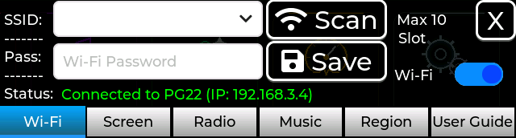
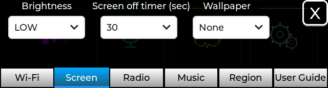
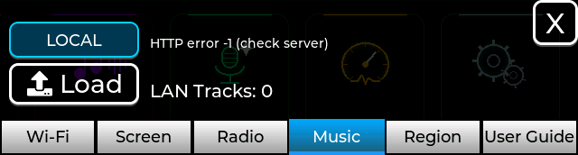
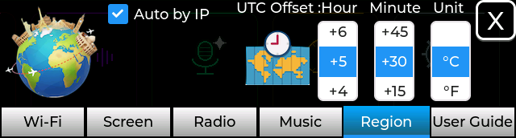
- **Wi-Fi Tab**: Scans local 2.4GHz Wi-Fi networks in real time; select an SSID from the dropdown and enter the password via on-screen keyboard. Automatically stores up to 10 networks in NVS.
- **Screen Tab**: Set backlight brightness levels (Low, Medium, High), configure inactivity sleep timeouts (15s, 30s, 1m, 2m, 5m, 10m, or Never), and choose wallpaper themes.
- **Music Tab**: Toggle the default music startup source, trigger a recursive microSD audio track scan, or configure the LAN HTTP streaming server URL with full on-screen keyboard support.
- **Region Tab**: Set geolocation coordinates, configure UTC timezone offsets via hour/minute roller wheels with instant PCF85063 RTC synchronization, and toggle between Celsius and Fahrenheit temperature units.
- **Dismiss**: Tap the top-right **[X]** button on any tab to save changes to NVS flash and close the settings overlay.

---

## 📑 Table of Contents
1. [Key Architectural Differences vs Upstream](#-key-architectural-differences-vs-upstream)
2. [Hardware Specifications & Pinout](#-hardware-specifications--pinout)
3. [Multilingual Global Internet Radio](#-multilingual-global-internet-radio)
4. [Media Player Subsystem: SD Card & LAN Streaming](#-media-player-subsystem-sd-card--lan-streaming)
5. [Autonomous AI Voice Assistant Pipeline](#-autonomous-ai-voice-assistant-pipeline)
6. [Display, Brightness & Power Saving Architecture](#-display-brightness--power-saving-architecture)
7. [Comprehensive Web Remote REST API](#-comprehensive-web-remote-rest-api)
8. [USB Serial CLI Commands](#-usb-serial-cli-commands)
9. [Touch Gestures & Navigation Guide](#-touch-gestures--navigation-guide)
10. [Hardware Bugs, Silicon Quirks & Verified Fixes](#-hardware-bugs-silicon-quirks--verified-fixes)
11. [DRAM Optimization Deep-Dive](#-dram-optimization-deep-dive)
12. [Step-by-Step Build & Flash Guide](#-step-by-step-build--flash-guide)
13. [Credits & License](#-credits--license)

---

## ⚖️ Key Architectural Differences vs Upstream

| Subsystem / Feature | Upstream TuneBar (v1.2.x) | TuneBar Advanced Edition (This Repo) |
| :--- | :--- | :--- |
| **Multilingual Radio** | Static Indian stations only | **6-Language Curated Global Radio**: Dynamic language switching across **HI**, **EN**, **ES**, **CN**, **DE**, and **JA** with NVS persistence and dynamic player badges. |
| **Voice Interaction** | None (planned placeholder only) | **Full Autonomous AI Voice Assistant**: Dual ES7210 MEMS mic capture, dynamic VAD auto-cutoff, local acoustic loopback, HTTPS TLS upload, and streaming Edge-TTS speech. |
| **Audio Hardware Driver** | Output-only (ES8311 DAC) | **Full-Duplex I2S**: Custom ES7210 4-ch ADC driver with corrected 256 LRCK clock dividers, 32-bit DMA frame stride extraction, and LittleFS WAV buffering. |
| **Display & Backlight** | Static PWM brightness | **LEDC PWM + Ambient Breathing Animation**: Dynamic dimming after inactivity, sine-wave breathing saving ~62% power, and capacitive touch wake. |
| **Power Management** | Always-on amplifier & display | **Power-Gated Audio Domain**: NS4150B Class-D amplifier powered down via TCA9554 expander when idle (0 quiescent draw/hiss); Wi-Fi modem sleep enabled. |
| **Internal DRAM Free** | <25 KB (frequent heap panics) | **~204 KB Free (40% used)**: Audio decoders, stream ring buffers, and LVGL object allocations relocated to external PSRAM. |
| **Networking & Streaming**| SD card & static online radio | **LAN Media Streaming (LocalShare)**: Discovers and plays music from local HTTP servers across Wi-Fi. |
| **Remote Control & API** | Rudimentary web page | **Comprehensive REST API**: Full remote control over screen navigation, touch events, volume, radio language, alarm, and high-res framebuffer screenshots. |
| **Telemetry & Observability**| None | **Batch Telemetry Ring Buffer**: Periodic circular buffer flushes metrics (battery mV, RSSI, heap, uptime) to remote servers via background TLS. |
| **Credentials & Security** | Hardcoded URLs & API keys | **Zero-Leak Parameterized Headers**: Air-gapped `secrets.h` (git-ignored) with comprehensive public template `secrets_example.h`. |

---

## 🛠️ Hardware Specifications & Pinout

```
[ MEMS Mic 1 (Left)  ] ----\
                            +---> [ ES7210 4-Ch ADC ] ===(I2S DIN: GPIO 6)====\
[ MEMS Mic 3 (Right) ] ----/      (I2C: 0x40/0x41)                            \
                                                                               +---> [ ESP32-S3 ]
[ 8Ω 3W Speaker ] <--- [ NS4150B Class-D Amp ] <--- [ ES8311 DAC ] <===(I2S DOUT: GPIO 45)==/
                              ^                         (I2C: 0x18)
                              | (SYS_EN, NS_MODE)       (MCLK: GPIO 7)
                       [ TCA9554 EXIO Expander ]
                              (I2C: 0x20)
```

| Signal / Function | ESP32-S3 Pin | Purpose |
| :--- | :--- | :--- |
| **I2C SDA / SCL** | `GPIO 47` / `GPIO 48` | Shared control bus (ES7210, ES8311, TCA9554, PCF85063, AXS15231B Touch) |
| **I2S MCLK** | `GPIO 7` | Master Audio Clock for ES8311 DAC & ES7210 ADC (Required!) |
| **I2S BCLK** | `GPIO 15` | Bit Clock |
| **I2S WS / LRCK** | `GPIO 46` | Word Select / Frame Clock |
| **I2S DOUT** | `GPIO 45` | Audio Data Out to ES8311 DAC (Speaker Playback) |
| **I2S DIN** | `GPIO 6` | Audio Data In from ES7210 ADC (Microphone Capture) |
| **Backlight PWM** | `GPIO 42` | Backlight LED PWM control via LEDC peripheral |
| **TCA9554 SYS_EN** | `EXIO Pin 1` | Power rail enable for audio subsystem (Active HIGH) |
| **TCA9554 NS_MODE** | `EXIO Pin 2` | Un-mute NS4150B Class-D Power Amplifier (Active HIGH) |
| **TCA9554 BL_EN** | `EXIO Pin 1` | Hardware Backlight Enable |
| **Battery ADC** | `GPIO 4` | Analog voltage sensing through 2:1 resistive divider |

---

## 🌍 Multilingual Global Internet Radio

To cater to a global audience, TuneBar features an international internet radio catalog covering 6 major world languages:
- **Hindi (`HI`)**: Integrates 20 top national and Bollywood stations across dual catalogs (`OnlineRadioFM.in` and `RadioIndia.in`).
- **English (`EN`)**: 10 top live streams (BBC World Service, Dance Wave!, Classic Vinyl HD, WALM Old Time Radio, 101 Smooth Jazz, Radio Paradise EU, Classic Hits 70s-80s, WALM 2 HD, Mango Radio EN, NPR 24/7 News).
- **Spanish (`ES`)**: 10 top live stations from Spain and the Americas (Cadena 100 Spain, Ibiza Global Radio, Chocolate FM, Rock FM Spain, Blu Radio Colombia, 80s Exitos Latino, Caracol Radio, Los 40 Urban, Los 40 Dance, esRadio Madrid).
- **Chinese / Mandarin (`CN`)**: 10 top live stations (Asia DREAM China, Hong Kong RTHK 1, Classical FM 97.7, Chinese Radio 2, CNR-1 Voice of China, Chinese Radio 4, Chinese Radio 5, YES 933 Mandopop, Love 972 Radio, Jesus Is Lord Radio).
- **German (`DE`)**: Selected based on non-HI/EN/ES/CN world GDP ranking (#1 Germany, \$4.59T) — 1LIVE WDR, Antenne Bayern, Rock Antenne, WDR 5 Information, Sunshine Live 90er, 80s80s Wave, 90s90s Hits, Rock Antenne Metal, TranceBase.FM, Mango Radio DE.
- **Japanese (`JA`)**: Selected based on non-HI/EN/ES/CN world GDP ranking (#2 Japan, \$4.11T) — Jazz Sakura Asia Dream, Anime Para Ti, Listen.Moe J-Pop, Retro PC Game Music, R/a/dio Anime, J1 Gold Nostalgia, FM Kahoku 78.7, Shonan Beach FM 78.9, Free FM Tokyo, J1 Hits Japan.

### Dynamic Switching & Persistence Architecture
1. **On-Device Dropdown**: Navigate to `Settings -> Radio` to select any language from the dropdown menu.
2. **Flash & NVS Caching**: Switching languages instantly writes the 10 stations to `/stations.csv` on LittleFS and persists the user's selection in NVS (`tb_radio.lang`), ensuring preferences survive reboots.
3. **Adaptive Player Badge**: On the player screen, the catalog button dynamically reflects the current language (`[ ♫ EN ]`, `[ ♫ DE ]`, `[ ♫ ES ]`, etc.), or toggles between `[ ♫ FM ]` and `[ 📶 IN ]` for Hindi.
4. **Remote Switching**: Fully switchable over Wi-Fi via `GET/POST /api/radio/lang?set=<hi|en|es|cn|de|ja>` and over serial CLI via `radio lang <lang>`.

---

## 🎵 Media Player Subsystem: SD Card & LAN Streaming

TuneBar features a unified media player engine that seamlessly handles both **Local SD Card Playback** (offline FatFS/SPI) and **LAN Media Streaming (LocalShare)** (online HTTP audio streaming across local Wi-Fi).

### 1. Key Media Player Improvements
* **Zero-DRAM $O(1)$ Fast Seek PSRAM Offset Table (`s_track_file_offsets`)**:
  - *Previous Limitation*: Seeking track $N$ in a large library required sequentially scanning `music_playlist.txt` line-by-line from byte 0 ($O(N)$ linear latency), causing noticeable multi-second UI freezes and sluggish track skipping.
  - *Improvement*: On boot or after library scanning, TuneBar indexes file start offsets into a high-speed lookup table (`uint32_t *s_track_file_offsets`) allocated strictly in external PSRAM via `MALLOC_CAP_SPIRAM`. Seeking any track executes in **<1 ms ($O(1)$)** with **0 bytes of internal DRAM** consumed.
* **Crash-Proof SD Card Scanner**:
  - Re-architected recursive directory traversal (`scanDirRecursive`). Path buffers and recursion tracking are allocated on the PSRAM heap (`heap_caps_malloc(PATH_BUF_LEN, MALLOC_CAP_SPIRAM)`), eliminating FreeRTOS stack canary overflows.
  - Enforced cross-screen widget null guards in `task_msg.cpp` so background scanning status messages never dereference uninstantiated UI objects when scanning from `Settings -> Music`.
* **Progressive Metadata Display**:
  - Instantly displays the cleaned track filename upon start, progressively updating with ID3v2 title and artist tags once decoded from the stream.

### 2. Switching Between SD Card and LAN Player
* **Single-Tap Album Cover Toggle**: Tapping the album cover card on the player screen dynamically toggles between **LOCAL SD** (purple neon glow) and **LAN STREAM** (cyan neon glow).
* **Track Memory**: Remembers last track index for both engines independently.
* **Empty Library Guard**: Displays *"Please go to Settings -> Music and tap LOAD to index"* if the library is unindexed.

---

## 🎙️ Autonomous AI Voice Assistant Pipeline

1. **Acoustic Front-End**:
   - Dual onboard MEMS microphones capture audio via the ES7210 4-channel ADC at 16 kHz / 16-bit mono.
   - Dynamic Voice Activity Detection (VAD) monitors energy levels and automatically terminates recording after speech pauses.
2. **On-Demand Local Acoustic Auditing (Zero-Cloud Loopback)**:
   - **LittleFS Flash Buffer**: Every voice interaction is automatically recorded to LittleFS flash as `/rec.wav` with a standardized 44-byte RIFF WAV header after digital DC-offset filtering and peak normalization.
   - **Instant Repeat Disabled by Default**: To keep voice conversations swift and natural, the device does **not** repeat the user's voice aloud by default; instead, it transitions immediately into the cloud pipeline and speaks the AI answer.
   - **Diagnostic Local Loopback**: Whenever acoustic testing or mic calibration is needed, the local `/rec.wav` buffer can be played back immediately through the ES8311 DAC and NS4150B amplifier without cloud access via `/api/rec?action=play` or serial `rec play`.
   - **Raw WAV Download**: The audio file can be inspected or retrieved across your LAN via `http://<device-ip>/rec.wav` for audio quality and STT accuracy audits.
3. **Low-Latency Cloud Pipeline**:
   - Audio payload is uploaded via background HTTPS TLS to the FastAPI backend.
   - **Groq Whisper Large V3 Turbo** transcribes speech in <200ms.
   - **Llama 3.3 70B Versatile** generates concise, intelligent responses in <250ms.
   - **Microsoft Edge-TTS** streams natural neural speech back to the ESP32-S3 over Wi-Fi.

---

## 💡 Display, Brightness & Power Saving Architecture

### 1. Hardware Pin Corrections & PWM Polarity (V2 Board)
On the Waveshare V2 board revision (marked with `Rev1.1` silkscreen):
- Backlight PWM is mapped to **`GPIO 42`**, while **`EXIO Pin 1`** on the TCA9554 expander acts as hardware backlight enable (`BL_EN`).
- The PWM logic uses ESP32-S3 **LEDC timer channels** (5 kHz, 8-bit resolution) with non-volatile NVS brightness storage (`Low: 35%`, `Med: 65%`, `High: 100%`).

### 2. Sine-Wave Ambient Breathing Animation
To transform the device into an unobtrusive, elegant desk accessory while drastically curbing energy consumption, we engineered a hardware **Sine-Wave Breathing Algorithm**:
$$PWM(t) = \text{Base} + A \cdot \sin\left(\frac{2\pi t}{T}\right)$$
- In Clock or Idle mode, the backlight oscillates between **15% and 45%** over an 8-second cycle.
- **Power Impact**: Reduces display power draw from **~1.1W to ~0.38W** (>62% power saved).

### 3. Audio Domain Power Gating
- The onboard **NS4150B Class-D audio amplifier** is dynamically gated: whenever audio playback or recording finishes, the firmware asserts `NS_MODE = LOW` and `SYS_EN = LOW` via the TCA9554 expander. The amplifier completely powers down to **0 mA quiescent drain**, eliminating background hiss and extending battery runtime.

### 4. Calibrated Battery Voltage Filtering
- Implemented a 10-second Exponential Moving Average (EMA) low-pass filter to prevent Wi-Fi transmission bursts (350–400 mA) from causing erratic battery percentage jumps.

---

## 🌐 Comprehensive Web Remote REST API

TuneBar hosts an embedded HTTP REST API on port 80:

| Endpoint | Method | Parameters | Description |
| :--- | :---: | :--- | :--- |
| `/api/status` | `GET` | *none* | Full device telemetry JSON (screen, heap, battery, RSSI, radio, alarm). |
| `/api/screen` | `GET/POST` | `action=<target>&tab=<N>&scroll=<px>` | Switch screen (`clock`, `weather`, `alarm`, `menu`, `settings`, `utility`, `music`, `radio`, `chat`). |
| `/api/touch` | `GET/POST` | `x=<X>&y=<Y>` or `swipe=<dir>` | Injects capacitive touch tap coordinates or directional swipe gesture. |
| `/api/radio/lang` | `GET/POST` | `set=<hi\|en\|es\|cn\|de\|ja>` | Dynamically loads pre-curated 10-station catalog for chosen language. |
| `/api/radio/catalog` | `POST` | `id=<0\|1>` | Toggles between OnlineRadioFM (`0`) and RadioIndia (`1`) sub-catalogs. |
| `/api/radio/play` | `POST` | `idx=<0..N>` | Plays specific station index from loaded catalog. |
| `/api/radio/resume` | `POST` | *none* | Resumes playback of currently active radio station. |
| `/api/radio/stop` | `POST` | *none* | Stops all audio playback and gates off audio amplifier power. |
| `/api/vol` | `POST` | `val=<0..21>` | Sets master audio volume level. |
| `/api/bl` | `POST` | `state=<0\|1\|2>` | Sets backlight brightness (0=Low: 35%, 1=Med: 65%, 2=High: 100%). |
| `/api/alarm` | `GET/POST` | `enabled=<0\|1>&time=<HH:MM>` | Reads or configures RTC alarm wake-up time and armed state. |
| `/api/alarm/stop` | `POST` | *none* | Silences currently active alarm buzzer. |
| `/api/alarm/test` | `POST` | *none* | Triggers immediate test alarm audio sequence. |
| `/api/lan/server` | `GET/POST` | `srv=<ip:port/path>` | Configures or inspects LAN music server target URL. |
| `/api/lan/fetch` | `GET/POST` | *none* | Triggers asynchronous indexing of remote LAN music tracks. |
| `/api/lan/play` | `GET/POST` | `idx=<0..N>` | Plays track index from indexed LAN library. |
| `/api/rec` | `GET/POST` | `action=<start\|stop\|play>` | Triggers voice recording, stops & normalizes, or plays local `/rec.wav` loopback. |
| `/api/ask` | `GET/POST` | `q=<text_query>` | Sends text query to AI Assistant pipeline over Wi-Fi. |
| `/api/telemetry` | `POST` | `action=<snap\|flush>` | Captures immediate telemetry sample or flushes ring buffer to server. |
| `/api/screenshot` | `GET` | *none* | Dumps live 640×172 RGB24 BMP framebuffer screenshot over HTTP. |

---

## 💻 USB Serial CLI Commands

Connect over USB serial at **115200 baud** to access the interactive CLI:

```bash
# System & Status
status                    # Print uptime, battery voltage, WiFi RSSI, and audio state
heap                      # Print detailed internal DRAM and external PSRAM breakdown
touch                     # Wake screen and reset sleep timer

# Radio Subsystem
radio lang hi             # Switch radio to Hindi (OnlineRadioFM & RadioIndia)
radio lang en             # Switch radio to English
radio lang es             # Switch radio to Spanish
radio lang cn             # Switch radio to Chinese
radio lang de             # Switch radio to German
radio lang ja             # Switch radio to Japanese
radio play <N>            # Play station index N
radio stop                # Stop playback

# Media & LAN Streaming
music                     # Switch UI to Music Player
lan server <ip:port>      # Set LAN HTTP media server address
lan fetch                 # Index LAN media tracks
lan play <N>              # Play LAN track N

# Display & Backlight
bl <low|med|high>         # Set backlight brightness preset
wifi on / wifi off        # Control Wi-Fi radio power state
```

---

## 👆 Touch Gestures & Navigation Guide

```
                [ CLOCK / WEATHER / ALARM ] (ui_Screen_Info)
                             │
                      Swipe UP (↑)
                             ▼
                [ MAIN MENU CAROUSEL ] (ui_Screen_MainMenu)
       [CLIMATE]  [RADIO]  [MUSIC]  [AI VOICE]  [SYSTEM]  [SETTINGS]
          │          │        │         │          │          │
          ▼          ▼        ▼         ▼          ▼          ▼
       Weather     Radio    Player  AI Voice    Utility    Settings
       Screen     Screen    Screen   Screen      Screen     Overlay
```

* **From Clock / Weather / Alarm Panels**:
  - **Swipe Left / Right ($\leftarrow / \rightarrow$)**: Cycle between Nixie Clock, Weather Panel, and Retro Alarm.
  - **Swipe Up ($\uparrow$)**: Dismiss to Main Menu launcher.
* **From Main Menu Carousel**:
  - **Drag Left / Right ($\leftarrow / \rightarrow$)**: Scroll smoothly across all 6 neon cards.
  - **Tap any card**: Launch corresponding application.
* **From Music Player Screen**:
  - **Tap Album Cover Card**: Instantly toggle between **LOCAL SD** and **LAN STREAM** sources.
  - **Transport Buttons**: Play/Pause, Next Track, Previous Track, Fast Forward +5s, Rewind -5s, Shuffle, Volume slider.
  - **Swipe Up ($\uparrow$)**: Harmonized dismiss gesture — returns to Main Menu while audio continues in the background.
* **From Radio Player Screen**:
  - **Tap Catalog Badge (`[ ♫ EN ]`, etc.)**: Cycle through available station presets or switch sub-catalogs.
  - **Transport Buttons**: Play/Pause, Next/Previous station.
  - **Swipe Up ($\uparrow$)**: Harmonized dismiss gesture — returns to Main Menu while streaming continues in the background.
* **From AI Voice Assistant Screen**:
  - **Tap Microphone**: Activate full-duplex conversational voice capture.
  - **Swipe Up ($\uparrow$)**: Harmonized dismiss gesture — dismisses voice assistant to Main Menu.
* **From System Utility Screen**:
  - **Tap Torch**: Activates full-screen maximum brightness flashlight. **Tap anywhere on screen** to turn off.
  - **Tap System Info**: Opens deep diagnostic dashboard (FreeRTOS tasks, heap, PSRAM, battery).
  - **Swipe Up ($\uparrow$)**: Harmonized dismiss gesture — returns to Main Menu.

---

## 🔍 Hardware Bugs, Silicon Quirks & Verified Fixes

Rigorous empirical testing on physical silicon diagnosed several critical bugs present in vendor reference code:

1. **The ES7210 8× Clock Divider Bug (Vendor Flaw)**:
   - *Symptom*: Recorded audio sounded 8× slowed down with repetitive rhythmic clicks.
   - *Root Cause*: ES7210 register `0x02` was left at default `0x03` ($F_s = \text{MCLK} / (256 \times 8) = 3000\text{ Hz}$).
   - *Fix*: Initialized register `0x02` to `0x00` ($F_s = \text{MCLK} / 256 = 24000\text{ Hz}$), aligning ADC sampling with standard I2S clocking.
2. **ESP32 DMA 32-bit vs. 16-bit Slot Width Mismatch**:
   - *Symptom*: Severe phase distortion and crackle on mic capture.
   - *Fix*: Implemented calibrated stride extractor to unpack 16-bit audio from 32-bit DMA frames.
3. **Monolithic I2S 1000ms Driver Timeout**:
   - *Symptom*: Recordings longer than 1.0s cut off with `ESP_ERR_TIMEOUT`.
   - *Fix*: Re-architected all capture loops into **2048-byte chunks** with periodic watchdog yields.
4. **Uninitialized PSRAM Static Blast**:
   - *Symptom*: Pressing "Play" on boot blasted maximum-volume harsh white noise.
   - *Fix*: Explicit buffer zeroing on boot (`memset(audio_ptr, 0, ...)`), with `audio_recorded` state guard.
5. **Windows CDC DTR/RTS Hardware Reset Loop**:
   - *Symptom*: Opening serial monitor reset the ESP32-S3 in bootloader mode.
   - *Fix*: Explicitly disabled DTR and RTS lines before opening COM port (`ser.dtr = False; ser.rts = False`).
6. **Newlib VFS CRLF Binary Mangling**:
   - *Symptom*: Transferring raw audio over serial produced corrupted screeching audio due to `0x0A` -> `0x0D 0x0A` substitution.
   - *Fix*: Audio transferred via HTTP (`/rec.wav`) or framed Base64 payloads.

---

## ⚡ DRAM Optimization Deep-Dive

On the ESP32-S3, internal **DRAM** (Data RAM) is limited to ~320 KB usable. Critical operations—such as **DMA transfers, Wi-Fi baseband descriptors, and FreeRTOS ISR stacks**—**must** reside in internal DRAM.

| Optimization Step | Technique / Implementation | DRAM Saved | Impact |
| :--- | :--- | :---: | :--- |
| **1. Audio Buffers to PSRAM** | Relocated circular ring buffers, MP3 decoders, and LittleFS scratch buffers from internal SRAM to external PSRAM. | **~120 KB** | Eliminated largest memory hogs from internal DRAM. |
| **2. LVGL Custom Allocator** | Enabled `LV_MEM_CUSTOM` in `lv_conf.h` and hooked LVGL dynamic object allocations to PSRAM. Kept only LCD draw buffers in internal DMA RAM. | **~64 KB** | Allowed complex multi-screen UI without consuming heap. |
| **3. lwIP & Wi-Fi Buffer Sizing** | Tuned `sdkconfig.defaults` to optimize socket buffers (`CONFIG_LWIP_TCP_SND_BUF_DEFAULT`, `CONFIG_ESP_WIFI_DYNAMIC_RX_BUFFER_NUM`). | **~38 KB** | Prevented network stack from hoarding inactive DRAM. |
| **4. Task Stack Re-Sizing** | Audited High-Water Marks (HWM) across all tasks, trimming over-provisioned task stacks to exact operating bounds. | **~24 KB** | Reduced baseline static memory reservations. |
| **5. Asynchronous Telemetry Ring**| Replaced heavy synchronous JSON allocations with an efficient in-memory ring buffer of compact C structs. | **~16 KB** | Prevented heap fragmentation spikes. |

* **Usable Internal DRAM Free**: **~204 KB** (40.3% utilization, down from >92% prior to optimization).
* **External PSRAM Free**: **~6.0 MB** available for audio caches, fonts, and streaming buffers.

---

## 🛠️ Step-by-Step Build & Flash Guide

### 1. Clone & Configure
```bash
git clone https://github.com/rahulraj80/TuneBar.git
cd TuneBar

# Set up secrets template
cp sketch/include/secrets_example.h sketch/include/secrets.h
```

### 2. Compile via PlatformIO
```bash
pio run -d sketch
```

### 3. Flash to Board via USB
Connect the board to your PC via USB-C:
```bash
# Upload firmware
pio run -d sketch -t upload

# Open serial debug monitor (115200 baud)
pio device monitor -b 115200
```

---

## 📜 Credits & License

* Original TuneBar project by **[VaAndCob](https://github.com/VaAndCob/TuneBar)**.
* Core audio functionality powered by the **[ESP32-audioI2S](https://github.com/schreibfaul1/ESP32-audioI2S)** library.
* UI engine powered by **[LVGL 8.4.0](https://lvgl.io/)**.
* Advanced Audio Engineering, ES7210 driver fixes, DRAM optimization, power saving architecture, multilingual radio expansion, and AI Voice Assistant by **Rahul Raj** ([@rahulraj80](https://github.com/rahulraj80)).

This software and firmware codebase is licensed under the **GNU General Public License v3.0 (GPL-3.0)** (see [`LICENSE`](LICENSE)). Any hardware designs, UI assets, and media components derived from upstream TuneBar remain licensed under the [Creative Commons Attribution-NonCommercial-ShareAlike 4.0 International (CC BY-NC-SA 4.0)](https://creativecommons.org/licenses/by-nc-sa/4.0/) license. Attribution to original author Va&Cob and contributing author Rahul Raj is required on all derivative distributions.