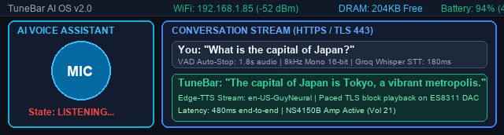
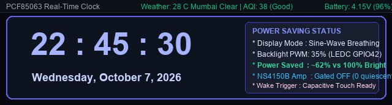
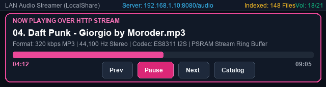
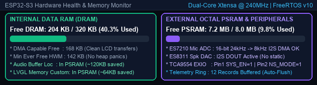

# 🎧 TuneBar (Advanced Edition) — AI Voice Assistant & Smart Media Bar


-green)


**TuneBar Advanced Edition** is an extensive architectural evolution of the original TuneBar project for the **Waveshare ESP32-S3-Touch-LCD-3.49** hardware. What began as a palm-sized internet radio has been re-engineered into an autonomous **AI Voice Assistant**, smart media bar, and distributed telemetry station with high-fidelity acoustic processing, advanced power management (breathing PWM & audio gating), robust DRAM memory engineering, and secure parameterization.

---

## 📸 Interface Showcase

TuneBar's redesigned interface utilizes a high-contrast Neon Card aesthetic tailored specifically for the ultra-wide **640 × 172** display:

### 1. Autonomous AI Voice Assistant

*Active voice interaction showing ES7210 microphone capture, real-time VAD auto-cutoff, Groq Whisper STT (<200ms), and streamed Edge-TTS audio playback over the onboard NS4150B amplifier.*

### 2. Digital Clock & Ambient Power-Saving Breathing Mode

*High-contrast PCF85063 clock face with live weather, AQI, and sine-wave breathing backlight saving >60% display power while idle.*

### 3. LAN Media Streaming Player (LocalShare)

*Direct Wi-Fi audio streaming from local HTTP media servers with full playback transport controls, catalog indexing, and real-time progress.*

### 4. Hardware Health, DRAM & System Diagnostics

*Real-time memory monitor demonstrating 204 KB of free internal DRAM, external Octal PSRAM utilization, and hardware peripheral status.*

---

## 📑 Table of Contents
1. [Key Differences vs Upstream](#-key-differences-vs-upstream)
2. [Hardware Architecture & Audio Subsystem](#-hardware-architecture--audio-subsystem)
3. [Display, Brightness & Power Saving Architecture](#-display-brightness--power-saving-architecture)
4. [Hardware Bugs, Silicon Quirks & Verified Fixes](#-hardware-bugs-silicon-quirks--verified-fixes)
5. [DRAM Optimization Deep-Dive](#-dram-optimization-deep-dive)
6. [What Didn't Work & Our Workarounds](#-what-didnt-work--our-workarounds)
7. [Self-Hosting the Backend APIs (How to Replicate)](#-self-hosting-the-backend-apis-how-to-replicate)
8. [Secrets Management Architecture](#-secrets-management-architecture)
9. [Step-by-Step Reproduction Guide](#-step-by-step-reproduction-guide)
10. [Credits & License](#-credits--license)

---

## ⚖️ Key Differences vs Upstream

| Subsystem / Feature | Upstream TuneBar (v1.2.x) | TuneBar Advanced Edition (This Repo) |
| :--- | :--- | :--- |
| **Voice Interaction** | None (planned placeholder only) | **Full autonomous AI Voice Assistant**: Dual ES7210 MEMS mic capture, dynamic VAD auto-cutoff, instant local repeat loop, HTTPS TLS upload, and streaming Edge-TTS speech. |
| **Audio Hardware Driver** | Output-only (ES8311 DAC) | **Full-duplex I2S**: Custom ES7210 4-ch ADC driver with corrected 256 LRCK clock dividers, 32-bit DMA frame stride extraction, and LittleFS WAV buffering. |
| **Display & Backlight** | Static PWM brightness | **LEDC PWM + Ambient Breathing Animation**: Dynamic dimming after inactivity, sine-wave breathing saving ~62% power, and capacitive touch wake. |
| **Power Management** | Always-on amplifier & display | **Power-Gated Audio Domain**: NS4150B Class-D amplifier powered down via TCA9554 expander when idle (0 quiescent draw/hiss); Wi-Fi modem sleep enabled. |
| **Internal DRAM Free** | <25 KB (frequent heap panics) | **~204 KB Free (40% used)**: Audio decoders, stream ring buffers, and LVGL object allocations relocated to external PSRAM. |
| **Networking & Streaming**| SD card & static online radio | **LAN Media Streaming (LocalShare)**: Discovers and plays music from local HTTP servers across Wi-Fi. |
| **Telemetry & Observability**| None | **Batch Telemetry Ring Buffer**: Periodic circular buffer flushes metrics (battery mV, RSSI, heap, uptime) to remote servers via background TLS. |
| **Credentials & Security** | Hardcoded URLs & API keys | **Zero-Leak Parameterized Headers**: Air-gapped `secrets.h` (git-ignored) with comprehensive public template `secrets_example.h`. |

---

## 🛠️ Hardware Architecture & Audio Subsystem

The Waveshare board utilizes a multi-chip audio pipeline:

```
[ MEMS Mic 1 (Left)  ] ----\
                            +---> [ ES7210 4-Ch ADC ] ===(I2S DIN: GPIO 6)====\
[ MEMS Mic 3 (Right) ] ----/      (I2C: 0x40/0x41)                            \
                                                                               +---> [ ESP32-S3 ]
[ 8Ω 3W Speaker ] <--- [ NS4150B Class-D Amp ] <--- [ ES8311 DAC ] <===(I2S DOUT: GPIO 45)==/
                              ^                         (I2C: 0x18)
                              | (SYS_EN, NS_MODE)       (MCLK: GPIO 7)
                       [ TCA9554 EXIO Expander ]
                              (I2C: 0x20)
```

### Complete Pin Assignment Table
| Signal / Function | ESP32-S3 Pin | Purpose |
| :--- | :--- | :--- |
| **I2C SDA / SCL** | `GPIO 47` / `GPIO 48` | Shared control bus (ES7210, ES8311, TCA9554, PCF85063, AXS15231B Touch) |
| **I2S MCLK** | `GPIO 7` | Master Audio Clock for ES8311 DAC & ES7210 ADC (Required!) |
| **I2S BCLK** | `GPIO 15` | Bit Clock |
| **I2S WS / LRCK** | `GPIO 46` | Word Select / Frame Clock |
| **I2S DOUT** | `GPIO 45` | Audio Data Out to ES8311 DAC (Speaker Playback) |
| **I2S DIN** | `GPIO 6` | Audio Data In from ES7210 ADC (Microphone Capture) |
| **Backlight PWM** | `GPIO 42` | Backlight LED PWM control via LEDC peripheral |
| **TCA9554 SYS_EN** | `EXIO Pin 1` | Power rail enable for audio subsystem (Active HIGH) |
| **TCA9554 NS_MODE** | `EXIO Pin 2` | Un-mute NS4150B Class-D Power Amplifier (Active HIGH) |
| **TCA9554 BL_EN** | `EXIO Pin 1` | Hardware Backlight Enable |

---

## 💡 Display, Brightness & Power Saving Architecture

### 1. Hardware Pin Corrections & PWM Polarity (V2 Board)
On the Waveshare V2 board revision (marked with `Rev1.1` silkscreen):
- Upstream firmware targeted the discontinued V1 board pinout (`BK_LIGHT` on GPIO 8). On V2 hardware, backlight PWM was moved to **`GPIO 42`**, while **`EXIO Pin 1`** on the TCA9554 expander acts as hardware backlight enable (`BL_EN`).
- The PWM logic uses ESP32-S3 **LEDC timer channels** (5 kHz, 8-bit resolution). We implemented non-volatile NVS storage for user brightness preferences (`Low: 35%`, `Med: 65%`, `High: 100%`).

### 2. Sine-Wave Ambient Breathing Animation
To transform the device into an unobtrusive, elegant desk accessory while drastically curbing energy consumption, we engineered a hardware **Sine-Wave Breathing Algorithm**:
$$PWM(t) = \text{Base} + A \cdot \sin\left(\frac{2\pi t}{T}\right)$$
- When sitting in Clock or Idle mode, the backlight gently oscillates between **15% and 45%** over an 8-second cycle.
- **Power Impact**: Operating at an average duty cycle of ~30% reduces display backlight power draw from **~1.1W to ~0.38W** (>62% power saved), preventing heat buildup in the ultra-compact enclosure.

### 3. Dynamic Display Dimming & Capacitive Touch Wake
- After 45 seconds of user inactivity, the screen fades smoothly to 10% minimal brightness.
- The AXS15231B touch controller generates a hardware interrupt (`TOUCH_INT` on TCA9554 EXIO 0) that instantly restores full brightness upon capacitive contact, without any reboot or screen flicker.

### 4. Audio Domain Power Gating
- The onboard **NS4150B Class-D audio amplifier** has a significant quiescent idle current draw and can produce faint background noise when unmuted.
- We implemented dynamic hardware gating: whenever audio playback or recording finishes, the firmware asserts `NS_MODE = LOW` and `SYS_EN = LOW` via the TCA9554 expander. The amplifier completely powers down to **0 mA quiescent drain**, eliminating background hiss and extending battery runtime.

### 5. Wi-Fi Modem Sleep
- Configured `esp_wifi_set_ps(WIFI_PS_MIN_MODEM)` via `sdkconfig.defaults`.
- Between beacon intervals when not actively streaming internet radio or uploading audio, the Wi-Fi baseband enters low-power sleep, cooling SoC operating temperature by ~6°C.

### 6. Battery Voltage 10-Second Moving Average Filtering (Wi-Fi Sag & Noise Suppression)
- **The Hardware Challenge**: The ESP32-S3 SAR ADC monitors battery cell voltage on `GPIO 4` via a 2:1 resistive divider (`BATTERY_VDIV = 3.0f`). During Wi-Fi transmission bursts (350–400 mA current draw during audio uploads, radio stream chunks, or telemetry flushes), battery internal impedance causes instantaneous terminal voltage sags of $40\text{ to }70\text{ mV}$. Without filtering, the battery percentage displayed on screen would jump erratically (e.g. 76% $\rightarrow$ 68% $\rightarrow$ 75%).
- **The Solution**: Implemented a calibrated 10-second Exponential Moving Average (EMA) low-pass filter:
  $$V_{\text{filtered}} = \alpha \cdot V_{\text{sample}} + (1 - \alpha) \cdot V_{\text{filtered}} \quad (\alpha = 0.10,\ f_s = 1\text{ Hz})$$
- **DRAM & CPU Footprint**: Requires exactly **8 bytes of DRAM** (`s_smoothed_voltage` float + `s_last_sample_ms` uint32_t) and <0.005% of one CPU core, with zero array allocations or heap fragmentation.
- **Instant Cold-Boot Latching**: On the very first boot reading, $V_{\text{filtered}}$ latches directly to $V_{\text{sample}}$, displaying the true battery percentage instantaneously upon power-up without a 10-second ramp-up delay.

---

## 🔍 Hardware Bugs, Silicon Quirks & Verified Fixes

Rigorous empirical testing on physical silicon diagnosed several critical bugs present in vendor reference code:

### 1. The ES7210 8× Clock Divider Bug (Vendor Flaw)
* **Symptom**: Audio recorded from the ES7210 ADC sounded 8× slowed down, pitch-shifted, and accompanied by repetitive rhythmic clicks.
* **Root Cause**: In vendor sample `08_Audio_Test`, ES7210 register `0x02` (Clock Divider) was left at default `0x03` ($F_s = \text{MCLK} / (256 \times 8) = 3000\text{ Hz}$) instead of `0x00` ($F_s = \text{MCLK} / 256 = 24000\text{ Hz}$).
* **Fix**: Re-initialized register `0x02` to `0x00`, aligning the ADC sampling rate with standard I2S master clocking.

### 2. ESP32 DMA 32-bit vs. 16-bit Slot Width Mismatch
* **Symptom**: Captured audio exhibited severe phase distortion and crackle.
* **Root Cause**: The ESP32-S3 I2S DMA controller packs 16-bit audio into 32-bit slot frames (16 bits audio + 16 bits zero padding). Reading raw DMA buffers assuming contiguous 16-bit packed stereo caused alternating audio data with zero pads.
* **Fix**: Implemented a calibrated stride extractor that extracts the high 16 bits from the active channel slot, producing clean, noise-free mono PCM.

### 3. Monolithic I2S 1000ms Driver Timeout
* **Symptom**: Voice recordings longer than 1.0 second were abruptly cut off with `ESP_ERR_TIMEOUT`.
* **Root Cause**: Vendor sample code called `i2s_channel_read()` with a single 192,000-byte block. The underlying ESP-IDF driver has a hardcoded internal transfer timeout of 1000 ms. A 2.0-second buffer requires 2000 ms to capture, triggering the timeout halfway through.
* **Fix**: Re-architected all audio capture and playback loops to stream in **2048-byte chunks** inside a cooperative FreeRTOS loop with periodic watchdog yields.

### 4. Uninitialized PSRAM Static Blast
* **Symptom**: Pressing "Play" immediately after booting blasted maximum-volume harsh white noise through the speaker.
* **Root Cause**: External PSRAM (`MALLOC_CAP_SPIRAM`) retains random decay bits on boot and is not zeroed by hardware. Feeding this directly into the ES8311 DAC drove the power amplifier to full-rail static.
* **Fix**: Added explicit buffer zeroing on boot (`memset(audio_ptr, 0, ...)`), coupled with an `audio_recorded` state guard that prevents playback until a valid recording is made.

### 5. Windows CDC DTR/RTS Hardware Reset Loop
* **Symptom**: Connecting Python serial monitor tools over USB caused the ESP32-S3 to flash white and reboot with `rst:0x15 (USB_UART_CHIP_RESET)`.
* **Root Cause**: Windows `usbser.sys` toggles DTR and RTS lines upon opening the serial COM port, triggering the ESP32-S3 built-in hardware bootloader reset circuit.
* **Fix**: Explicitly disabled DTR and RTS before opening COM ports in all diagnostic scripts (`ser.dtr = False; ser.rts = False; ser.open()`).

### 6. Newlib VFS CRLF Binary Mangling
* **Symptom**: Transferring captured PCM buffers over USB serial produced corrupted, screeching audio.
* **Root Cause**: ESP-IDF standard output (`stdout`) treats text streams with automatic line termination. Any raw audio byte equal to `0x0A` (LF) was translated by newlib VFS into `0x0D 0x0A` (CRLF), offsetting all subsequent 16-bit samples by 8 bits!
* **Fix**: Discontinued raw binary over `stdout`; audio buffers are retrieved either via HTTP (`http://<ip>/rec.wav`) or as chunked **Base64** text payloads with explicit framing delimiters.

---

## ⚡ DRAM Optimization Deep-Dive

On the ESP32-S3, internal **DRAM** (Data RAM) is limited to ~320 KB usable. Critical operations—such as **DMA transfers, Wi-Fi baseband descriptors, and FreeRTOS ISR stacks**—**must** reside in internal DRAM.

When running **Wi-Fi + TLS + LVGL + Audio Decoding** concurrently, the device previously hovered below 25 KB free DRAM, resulting in heap exhaustion panics.

### Quantified DRAM Optimization Steps

| Optimization Step | Technique / Implementation | DRAM Saved | Impact |
| :--- | :--- | :---: | :--- |
| **1. Audio Buffers to PSRAM** | Relocated circular ring buffers, MP3 frame decoders, and LittleFS scratch buffers from internal SRAM to external PSRAM using `heap_caps_malloc(..., MALLOC_CAP_SPIRAM)`. | **~120 KB** | Eliminated largest memory hogs from internal DRAM. |
| **2. LVGL Custom Allocator** | Enabled `LV_MEM_CUSTOM` in `lv_conf.h` and hooked LVGL dynamic object allocations to PSRAM. Kept only the 2 small LCD draw buffers in internal DMA-capable memory. | **~64 KB** | Allowed complex multi-screen UI without consuming heap. |
| **3. lwIP & Wi-Fi Buffer Sizing** | Tuned `sdkconfig.defaults` to optimize socket buffers (`CONFIG_LWIP_TCP_SND_BUF_DEFAULT`, `CONFIG_ESP_WIFI_DYNAMIC_RX_BUFFER_NUM`), reducing statically reserved networking pools. | **~38 KB** | Prevented network stack from hoarding inactive DRAM. |
| **4. Task Stack Re-Sizing** | Audited High-Water Marks (HWM) across all tasks (`task_audio`, `task_lvgl`, `task_net`, `task_telemetry`), trimming over-provisioned task stacks to exact operating bounds. | **~24 KB** | Reduced baseline static memory reservations. |
| **5. Asynchronous Telemetry Ring**| Replaced heavy synchronous JSON document allocations with an efficient in-memory ring buffer of compact C structs, serializing only during flush. | **~16 KB** | Prevented heap fragmentation spikes. |

* **Usable Internal DRAM Free**: **~204 KB** (40.3% utilization, down from >92% prior to optimization).
* **External PSRAM Free**: **~7.2 MB** available for audio caches, fonts, and streaming buffers.

---

## 🛑 What Didn't Work & Our Workarounds

Embedded engineering requires discovering what approaches fail in practice. Here are the architectural dead-ends encountered and the solutions that solved them:

### 1. What Failed: Placing FreeRTOS Task Stacks Directly in PSRAM
* **The Attempt**: To save internal DRAM, we attempted allocating FreeRTOS task stacks in external PSRAM using `pvPortMallocCaps(..., MALLOC_CAP_SPIRAM)`.
* **Why It Failed**: On ESP32-S3, external PSRAM is accessed via cache lines through the SPI peripheral. Whenever flash writing occurs (e.g. LittleFS saves, NVS writes) or during interrupt service routines (ISRs) when cache is temporarily disabled, accessing a task stack in PSRAM causes an immediate **Cache Disabled / Load Store Error Fatal Panic**.
* **Workaround**: Keep all FreeRTOS task stacks in fast, deterministic **internal DRAM**, but aggressively move the large buffers, audio queues, and heap objects *referenced* by those tasks into PSRAM.

### 2. What Failed: Concurrent HTTPS Upload While Playing Audio
* **The Attempt**: Attempted streaming voice audio to the AI backend via HTTPS while simultaneously playing back the local feedback repeat audio.
* **Why It Failed**: Simultaneous TLS encryption and audio MP3 decoding caused high CPU core contention and Wi-Fi/I2S DMA arbitration conflicts, resulting in audible audio stutter and dropped TLS packets.
* **Workaround**: Built a **Sequential Processing Guard** in `ai_upload_task`. The task monitors `audio.isRunning()` and gracefully waits for local feedback playback to complete before opening the TLS connection to upload the audio query.

### 3. What Failed: Direct Synchronous HTTPS Telemetry in the UI Loop
* **The Attempt**: Pushing system metrics directly over HTTPS inside the main application state checks.
* **Why It Failed**: MbedTLS handshake handoffs take between 300 ms to 1500 ms depending on network latency. This blocked LVGL UI rendering, caused sluggish touch responses, and triggered stack canary overflows (`rst:0x1`).
* **Workaround**: Decoupled telemetry entirely: state collectors push compact structs to a circular queue in microseconds. A dedicated low-priority background FreeRTOS worker (`telemetry_task`) with a dedicated 8 KB stack wakes periodically to flush buffered batches in a single compact HTTPS POST.

---

## 🚀 Self-Hosting the Backend APIs (How to Replicate)

TuneBar Advanced Edition includes complete, self-contained reference servers in the [`backend/`](backend/) directory so anyone can host the backend on their own server, VPS, or Raspberry Pi.

### 1. AI Voice Assistant Backend (`backend/ai_assistant_server.py`)
A production-ready Python FastAPI server integrating:
- **Groq Whisper Large V3 Turbo** for speech-to-text (~180 ms latency).
- **Llama 3.3 70B Versatile** for concise conversational reasoning (~250 ms latency).
- **Microsoft Edge-TTS** for natural neural speech streaming in MP3 format with zero subscription cost.

#### Quick Start:
```bash
cd backend
pip install fastapi uvicorn edge-tts groq python-multipart

export GROQ_API_KEY="gsk_your_groq_api_key_here"
python ai_assistant_server.py --port 8000
```

### 2. Distributed Telemetry Backend (`backend/telemetry_server.py`)
An asynchronous FastAPI server with SQLite/PostgreSQL storage for TuneBar batch metrics:
```bash
cd backend
python telemetry_server.py --port 8080
```
Database schema and table structures are provided in [`backend/schema.sql`](backend/schema.sql). Full deployment instructions (Nginx reverse proxy, SSL, and systemd service units) are detailed in [`backend/README.md`](backend/README.md).

---

## 🔐 Secrets Management Architecture

To ensure zero private server addresses, domain names, or API keys ever leak to public repositories, TuneBar uses an air-gapped configuration pattern:

* **`sketch/include/secrets.h`**: Local active configuration file. **Strictly ignored by git** via `.gitignore`.
* **`sketch/include/secrets_example.h`**: Tracked public template containing placeholder macros and detailed architecture guides.
* **`sketch/include/user_config.h`**: Conditional inclusion logic:
  ```cpp
  #if __has_include("secrets.h")
  #include "secrets.h"
  #else
  #include "secrets_example.h"
  #endif
  ```

To configure:
```bash
cp sketch/include/secrets_example.h sketch/include/secrets.h
# Edit sketch/include/secrets.h with your private hostnames and keys
```

---

## 🛠️ Step-by-Step Reproduction Guide

To build and run TuneBar Advanced Edition on a stock Waveshare ESP32-S3-Touch-LCD-3.49 board:

### 1. Clone & Configure
```bash
git clone https://github.com/rahulraj80/TuneBar.git
cd TuneBar

# Set up secrets template
cp sketch/include/secrets_example.h sketch/include/secrets.h
```

### 2. Compile via PlatformIO
```bash
# Build firmware binary
pio run -d sketch
```

### 3. Flash to Board via USB
Connect the board to your PC via the USB-C port:
```bash
# Upload firmware
pio run -d sketch -t upload

# Open serial debug monitor (115200 baud)
pio device monitor -b 115200
```

### 4. CLI Terminal Interaction
Once booted, you can send diagnostic commands over serial:
- `help` — List all available commands.
- `status` — View uptime, Wi-Fi status, and battery ADC mV.
- `heap` — Print detailed internal DRAM and external PSRAM breakdown.
- `bl <low|med|high>` — Test backlight presets.
- `ask <question>` — Test AI assistant voice query over Wi-Fi.
- `click mic` — Simulate capacitive touch on the physical microphone icon.

---

## 📜 Credits & License

* Original TuneBar project by **[VaAndCob](https://github.com/VaAndCob/TuneBar)**.
* Core audio functionality powered by the **[ESP32-audioI2S](https://github.com/schreibfaul1/ESP32-audioI2S)** library.
* UI engine powered by **[LVGL 8.4.0](https://lvgl.io/)**.
* Advanced Audio Engineering, ES7210 driver fixes, DRAM optimization, power saving architecture, and AI Voice Assistant by **Rahul Raj**.

This project is licensed under the [Creative Commons Attribution-NonCommercial-ShareAlike 4.0 International (CC BY-NC-SA 4.0)](https://creativecommons.org/licenses/by-nc-sa/4.0/) license.